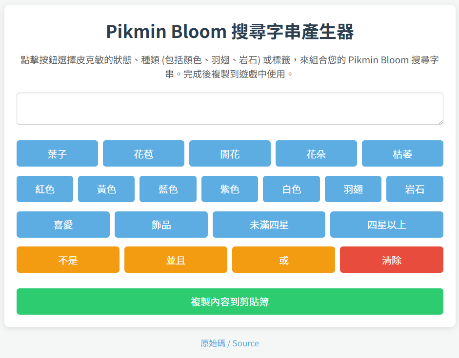

# Pikmin Bloom 搜尋字串產生器

一個專為 Pikmin Bloom 設計的搜尋字串組合工具，透過點擊按鈕快速產生搜尋條件，再複製到遊戲中使用。

線上版本：[craze429.github.io/PikminQueryBuilder](https://craze429.github.io/PikminQueryBuilder/)



## 功能

- 選擇皮克敏的**狀態**：葉子、花苞、開花、花朵、枯萎
- 選擇皮克敏的**種類**：紅色、黃色、藍色、紫色、白色、羽翅、岩石
- 選擇**標籤**：喜愛、飾品、未滿四星、四星以上
- 使用**邏輯運算**：不是（NOT）、並且（AND）、或（OR）
- 一鍵複製結果到剪貼簿
- 支援 PWA，可安裝到手機主畫面

## 本地開發

```bash
npm install
npm run generate-certs   # 產生自簽 SSL 憑證
npm start                # 啟動伺服器（HTTPS :3443）
```

## 部署

```bash
npm run deploy   # 發佈到 GitHub Pages（gh-pages branch）
```
